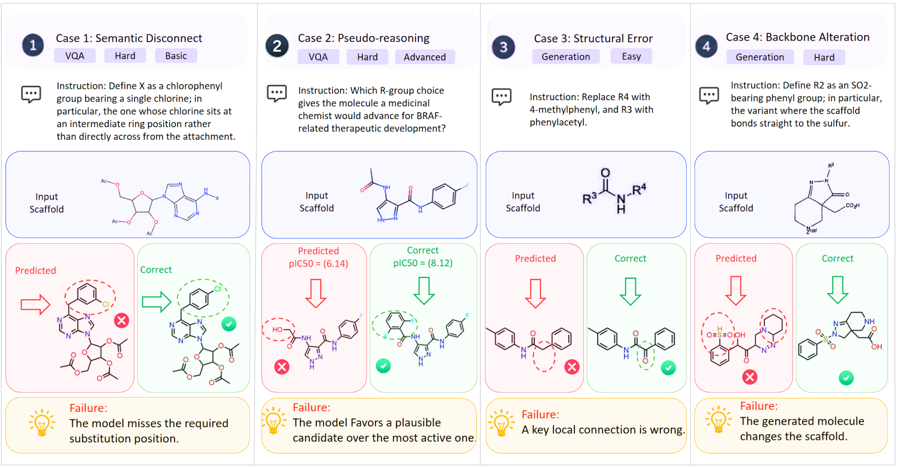

# R-GroundBench

R-GroundBench is a diagnostic benchmark for evaluating R-group grounding in Markush molecular editing. Given a Markush scaffold, an R-group instruction or property question, and benchmark inputs from the released dataset, the evaluation code measures whether a model selects or generates the correct edited molecule.

This repository contains the public evaluation package only. Dataset files are released separately on Hugging Face and should be placed under `data/` before running the evaluators. The data construction and editing pipeline is not included in this repository.

## Overview



- [Teaser figure (PDF)](images/R_GROUNDBENCH_teaser_v1.1.pdf)
- [R-group framework (PDF)](images/r-frame.drawio.pdf)

## Repository Layout

- `evaluation/`: VQA evaluation, generation evaluation, scaffold-match verification, result cleanup, and symbolic/template baselines.
- `scripts/`: evaluation helper scripts and dataset smoke tests.
- `examples/`: small schematic input/output examples.
- `prompts/`: reference system prompts and prompt templates.
- `configs/`: example API/model/path configuration files.
- `DATA_FORMAT.md`: benchmark input and output schemas.
- `images/`: paper figures (teaser, R-group framework, and case study).

## Installation

Create a fresh Python environment and install dependencies:

```bash
pip install -r requirements.txt
```

RDKit is required. If the PyPI wheel is unavailable on your platform, install RDKit with conda first:

```bash
conda install -c conda-forge rdkit
pip install -r requirements.txt
```

## Data

Download the released benchmark dataset from Hugging Face and arrange it as:

```text
data/
  vqa_dataset/
    easy_basic/
    medium_basic/
    hard_basic/
    easy_advanced/
    medium_advanced/
    hard_advanced/
  generation_qa/
    easy/
    hard/
```

The evaluators use these defaults:

```bash
export RGBENCH_VQA_DIR=data/vqa_dataset
export RGBENCH_GEN_DIR=data/generation_qa
export RGBENCH_RESULTS_DIR=results
```

See `DATA_FORMAT.md` for the expected fields.

## API Configuration

The model evaluators use an OpenAI-compatible chat-completions API:

```bash
export OPENAI_API_KEY=your_api_key
export OPENAI_BASE_URL=https://api.openai.com/v1
```

`OPENAI_BASE_URL` is optional for the default OpenAI endpoint. Set it only when using another OpenAI-compatible provider.

## VQA Evaluation

Run all VQA modes and splits for one model:

```bash
python evaluation/eval_vqa.py --model gpt-4o
```

Run selected modes and splits:

```bash
python evaluation/eval_vqa.py \
  --model gpt-4o \
  --mode img_smi \
  --split easy_basic medium_basic hard_basic
```

Outputs are written to `results/vqa/<model>/`.

## Generation Evaluation

Run SMILES-to-SMILES generation:

```bash
python evaluation/eval_generation.py --model gpt-4o --mode smi
```

Run image-to-SMILES generation on selected splits:

```bash
python evaluation/eval_generation.py \
  --model gpt-4o \
  --mode img \
  --splits easy hard
```

Outputs are written to `results/generation/<model>/`.

## Chemical-Domain Baselines

External chemical-domain model checkpoints are not redistributed here. Store their prediction files locally and evaluate them with:

```bash
python evaluation/eval_mg2_pipeline.py --task vqa --scaffold_mode gt --split easy_basic medium_basic hard_basic
python evaluation/eval_mg2_pipeline.py --task gen --scaffold_mode gt --split easy hard
```

For predicted scaffold mode:

```bash
python evaluation/eval_mg2_pipeline.py \
  --task vqa \
  --scaffold_mode mg2 \
  --mg2_pred_dir path/to/predictions
```

## Metrics

VQA uses exact multiple-choice accuracy after parsing the model answer as `A`, `B`, `C`, or `D`.

Generation uses:

- validity: whether the parsed output is a valid RDKit molecule;
- Exact Match: canonical SMILES equality with the ground truth;
- Tanimoto: ECFP4 fingerprint similarity;
- Scaffold Match: MCS-based scaffold preservation with at least 80 percent scaffold heavy-atom coverage.
